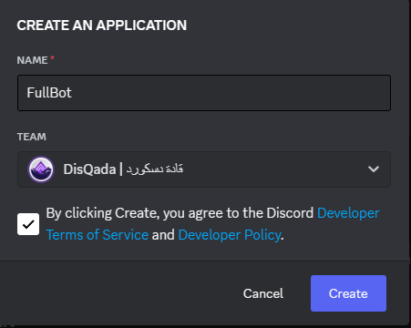
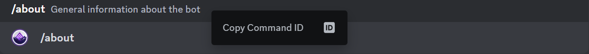
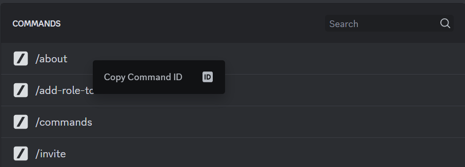
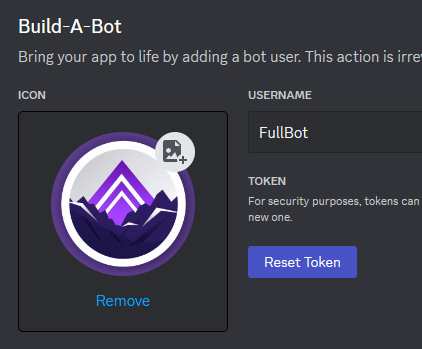
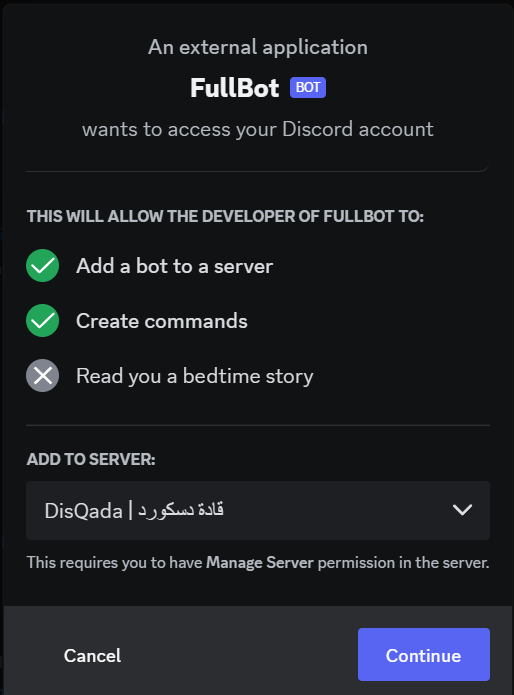
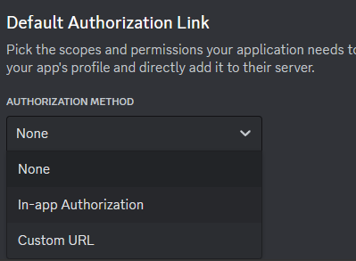
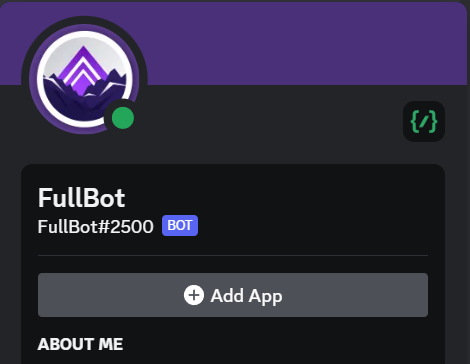

<div align="right">

# FullBot | البوت الكامل

[](https://www.npmjs.com/package/@disqada/halfbot/v/3.1.3)
[](https://github.com/DisQada/FullBot/generate)

# الترجمات

- [الإنجليزية | English](README.md)

# الفهرس

- [FullBot | البوت الكامل](#fullbot--البوت-الكامل)
- [الترجمات](#الترجمات)
- [الفهرس](#الفهرس)
- [عن المشروع](#عن-المشروع)
- [الإعداد](#الإعداد)
  - [تطبيق بوت](#تطبيق-بوت)
    - [رمز البوت](#رمز-البوت)
    - [رابط الدعوة](#رابط-الدعوة)
    - [زر الدعوة](#زر-الدعوة)
  - [كود البوت](#كود-البوت)
    - [بيئة](#بيئة)
    - [التبعيات](#التبعيات)
    - [تشغيل البوت](#تشغيل-البوت)
- [التطوير](#التطوير)
  - [بيانات البوت](#بيانات-البوت)
  - [وحدات البوت](#وحدات-البوت)
    - [مقتطفات الكود](#مقتطفات-الكود)
  - [إضافي](#إضافي)
    - [برامج NPM النصية](#برامج-npm-النصية)

# عن المشروع

قالب لكود بوت دسكورد باستخدام إطار عمل [HalfBot][halfbot]


# الإعداد

## تطبيق بوت

اذهب إلى [بوابة تطوير دسكورد](https://discord.com/developers/applications)، واضغط على `New Application` واملأ المعلومات المطلوبة



قم بتخصيص الروبوت الخاص بك كما تريد، نوصي بإضافة علامات نظراً لأنها تستخدم بواسطة الأمر `/about`، ونوصي أيضًا بإضافة أهم الأوامر في وصف التطبيق الخاص بك باستخدام السياق `</اسم_الأمر:معرف_الأمر>`، يمكنك الحصول على معرف الأمر عن طريق النقر بزر الفأرة الأيمن فوق منطقة وصف الأمر عند ندائه



يمكنك أيضًا الحصول على معرف الأمر من `Server Settings => Integrations => (بوتك)` عن طريق النقر بزر الفأرة الأيمن على منطقة الأمر


### رمز البوت

انتقل إلى قسم `Bot` الموجود على يسار شريط التنقل، ثم انسخ الرمز إذا كان ظاهراً، وإذا لم يكن كذلك، فما عليك سوى النقر على `Reset Token` ونسخه وحفظه في مكان آمن لأننا سنحتاج إليه لاحقاً



### رابط الدعوة

انتقل إلى قسم `URL Generator` ضمن قسم `OAuth2` الموجود على يسار شريط التنقل، وهنا يمكننا إنشاء رابط دعوة للبوت حتى تتمكن من دعوته إلى خادمك

اختر ما يلي للبدء:
- النطاقات: bot, apps.commands
- أذونات بوت: Administrator

> يمكنك إنشاء واحدة مختلفة لاحقًا

سينتهي بك الأمر برابط مشابه للذي هو موضح أدناه، إذا واجهت أي مشاكل في الخطوات السابقة، انسخ هذا الرابط وقم بتغيير قيمة `CLIENT_ID`، التي يمكنك نسخها من قسم `General Information` الموجود على اليسار في شريط التنقل شريط تحت اسم `Application ID`

> https://discord.com/api/oauth2/authorize?client_id=CLIENT_ID&permissions=8&scope=bot+applications.commands

خذ الرابط النهائي الذي لديك والصقه في أي متصفح أو في دسكورد (ثم اضغط عليه) وسيظهر نموذج دعوة البوت



### زر الدعوة

هناك طريقة أسهل بكثير للسماح للأشخاص بدعوة بوتك إلى خوادمهم بدلاً من منحهم الرابط الذي قمت بإنشائه مسبقاً أو استخدام أمر لإنشاء رابط الدعوة (إلا إذا كنت تريد أن يتمكن فقط أشخاص محددون من دعوة بوتك إلى خوادمهم)

انتقل إلى قسم `General` ضمن `OAuth2` على اليسار في شريط التنقل، ثم اضغط على القائمة المنسدلة أدناه واختر `In-app Authorization`



سيظهر مربع تحديد النطاقات والأذونات، اختر النطاقات والأذونات التي تريدها ثم انقر فوق `Save`، والآن أصبح لدى بوتك زر دعوة جميل في ملفه الشخصي
> لا تختر أبدًا إذن `Administrator` نظراً لأنها تمنح أذونات كاملة وعادةً لن يثق الأشخاص في البوتات التي تطلب هذا الإذن، لذا ما عليك سوى اختيار الحد الأدنى من الأذونات المطلوبة ليعمل بوتك



## كود البوت

### بيئة

قم بإنشاء ملف يدعى `.env` في المسار الجذري لمشروعك، ولا تقم أبداً بنقل هذا الملف أو إعادة تسميته، حيث سيخزن هذا الملف بيانات حساسة، لذا احتفظ به آمناً ولا تشاركه أبداً مع أي شخص، والأهم من ذلك لا ترفعه إلى GitHub، يمكنك القيام بذلك عن طريق التأكد من وجود سطر ".env" داخل ملف `.gitignore` الخاص بك

انسخ ما يلي في ملف `.env` الخاص بك، ثم استبدل `PUT_YOUR_TOKEN_HERE` برمز البوت الذي يفترض أن حفظته بالفعل، إذا لم يكن الأمر كذلك، فاقرأ قسم [رمز البوت](#رمز-البوت)

```bash
TOKEN=PUT_YOUR_TOKEN_HERE
```

⚠️⚠️ لا تشارك رمزك مع أي شخص ⚠️⚠️

### التبعيات

لتنزيل كافة الحزم المطلوبة، قم بتشغيل الأمر التالي

```bash
run setup npm
```

### تشغيل البوت

الآن كل ما تبقى هو تشغيل البوت وتجربته عن طريق تشغيل الأمر التالي

```bash
npm run start
```

# التطوير

الآن بعد أن انتهينا من إعداد البوت وأصبح جاهزاً، قد حان الوقت لتعديله من خلال وضع علامتك التجارية بالإضافة إلى تحديث وظائف البوت الحالية وإضافة وظائف جديدة

## بيانات البوت

يحتوي المجلد `data/` على بيانات متنوعة مخزنة في ملفات JSON، عند التهيئة، سيقرأها البوت ويخزنها بداخله باسم `bot.data.FILE_NAME`

هنا يجب عليك تخزين المعلومات غير الحساسة التي يتم استخدامها في البوت مثل معرفات النقابة/القناة/الرتبة/المستخدم أو روابط التواصل الاجتماعي الخاصة بالعلامة التجارية أو أي شيء آخر، فمن الأفضل فصل البيانات عن المنطق

> يجب أن تكون الملفات الموجودة داخل المجلد `data/` ملفات JSON فقط ويجب ألا تحتوي على تعليقات أو أي شيء غير مقبول بواسطة دالة `JSON.parse()`

> إذا كنت تريد إعادة تسمية المجلد `data/` أو تغيير مساره، فيجب عليك تغيير قيمة `directories.data` في ملف `bot/launch.js`

## وحدات البوت

يجب أن تندرج وحدات الروبوت ضمن المجلد `bot/modules/`، هناك نوعان من الوحدات عبارة عن أوامر وأحداث، ولكل منها مجلد خاص بها

### مقتطفات الكود

هناك مقتطفات أكواد لمساعدتك في إنشاء ملفات وحدة البوت بشكل أسرع بكثير، تم تكوينها مسبقاً داخل ملف `.vscode/`، وتدعم هذه المقتطفات JavaScript CommonJS و JavaScript ES Module و TypeScript

> ES Module (import/export) غير مدعومة بعد في [HalfBot][halfbot]، استخدم CommonJS (require()) فقط في الوقت الحالي

مقتطفات الكود المتاحة هي على النحو التالي

- أمر: command
- حدث
  - حدث العميل: event-client
  - حدث متكرر: event-repeat

## إضافي

هناك بعض الإعدادات التي تم تكوينها بالفعل في `.vscode/` و `.prettierrc.json` و `.eslintrc.json`، يفضل عدم تغيير أي شيء فيها إذا كانت هذه هي المرة الأولى التي تستخدم فيها Node.js

### برامج NPM النصية

يمكنك تشغيل برامج npm النصية التالية لإجراء الفحص والتنسيق على التوالي

```bash
npm run lint
```
```bash
npm run format
```

</div>

[halfbot]: https://github.com/DisQada/HalfBot