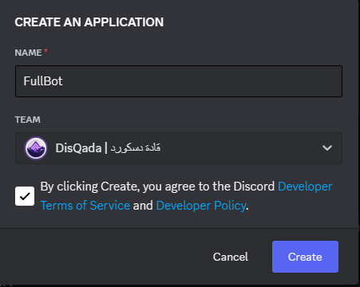
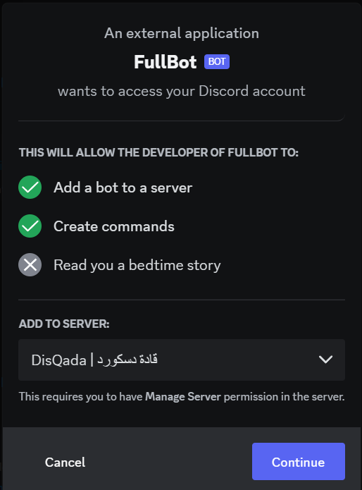
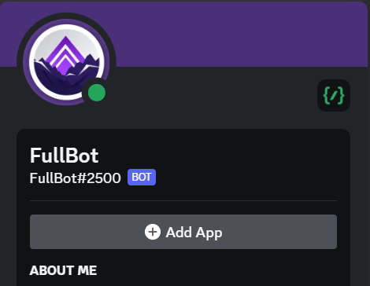

# FullBot

[](https://www.npmjs.com/package/@disqada/halfbot/v/3.1.3)
[](https://github.com/DisQada/FullBot/generate)

# Translations

- [Arabic | العربية](README.ar.md)

# Table of Contents

- [FullBot](#fullbot)
- [Translations](#translations)
- [Table of Contents](#table-of-contents)
- [About The Project](#about-the-project)
- [Setup](#setup)
  - [Bot Application](#bot-application)
    - [Bot Token](#bot-token)
    - [Invite Link](#invite-link)
    - [Invite Button](#invite-button)
  - [Bot Code](#bot-code)
    - [Environment](#environment)
    - [Dependencies](#dependencies)
    - [Running the Bot](#running-the-bot)
- [Developing](#developing)
  - [Bot Data](#bot-data)
  - [Bot Modules](#bot-modules)
    - [Code Snippets](#code-snippets)
  - [Additional](#additional)
    - [NPM scripts](#npm-scripts)

# About The Project

A template for Discord bot code using [HalfBot][halfbot] framework

# Setup

## Bot Application

Go to the [Discord Developer Portal](https://discord.com/developers/applications), Press on `New Application` and fill in the required information



Customise your bot however you want, we recommend adding tags since it's used by the `/about` command, we also recommend adding the most important commands in your application description using the context `</COMMAND_NAME:COMMAND_ID>`, you can get the command id by right-clicking the command description area when calling it


You can also get the command id from `Server Settings => Integrations => (Your bot)` by right-clicking the command area


### Bot Token

Go to the `Bot` section left on the navigation bar then copy the token if it's shown, if not then just click `Reset Token` and copy it and save it in a safe place because we'll need it later


### Invite Link

Go to the `URL Generator` section under `OAuth2` section left on the navigation bar, here we can generate an invite link for the bot so you can invite it to your server

Choose the following for starting:

- Scopes: bot, applications.commands
- Bot Permissions: Administrator

> You can generate a different one later

You'll end up with a link similar to the one shown below, if you face any problems in the last steps copy this link and change the `CLIENT_ID` value, which you can copy from the `General Information` section left on the navigation bar under the name `Application ID`

> https://discord.com/api/oauth2/authorize?client_id=CLIENT_ID&permissions=8&scope=bot+applications.commands

Take the final link you have and paste it in any browser or in Discord (then click it) and the bot invite form will show up



### Invite Button

There's a much easier way to let people invite you're bot to their servers other than giving them the link you created earlier or using a command to generate the invite link (unless you want only selected people to be able to invite your bot to their servers)

Go to the `General` section under `OAuth2` left in the navigation bar, press on the dropdown below and choose `In-app Authorization`


A scopes-and-permissions box checks will show up, choose the scopes and permissions you want then click save, now your bot has a beautiful invite button on it's profile

> Never choose the `Administrator` permissions since it gives full permissions and usually people won't trust bots asking for this permission turned on, so just choose the minimal required permissions for your bot to run



## Bot Code

### Environment

Create a file called `.env` in the root path of your project, never move or rename this file, this file will store sensitive data so keep it safe and never share it with anyone and most importantly don't push it to GitHub, you can do so by making sure that there's a '.env' line in your `.gitignore` file

Copy the following into your `.env` file then Replace `PUT_YOUR_TOKEN_HERE` with your own bot token that you should've saved already, if not then read the [Bot Token](#bot-token) section

```bash
TOKEN=PUT_YOUR_TOKEN_HERE
```

⚠️⚠️ DO NOT SHARE your TOKEN with anyone ⚠️⚠️

### Dependencies

To download all the required packages, run the following command

```bash
npm run setup
```

### Running the Bot

Now all that remains is to run the bot and try it out by running the following command

```bash
npm run start
```

# Developing

Now that we have the bot setup and ready, it's time to modify it by putting your brand as well as updating the existing bot functionalities and adding new ones

## Bot Data

The folder `data/` contains various data stored in JSON files, upon initialisation, the bot will read them and store them inside it as `bot.data.FILE_NAME`

Here you should store non-sensitive informations that are used in the bot like guild/channel/role/user IDs or brand social media links or anything else, it's better to separate the data from the logic

> The files inside the `data/` folder must be JSON files only and mustn't contain and comments or anything that's not acceptable by the `JSON.parse()` function

> If you want to rename the `data/` folder or change it's path then you must change the value of the `directories.data` in the `bot/launch.js` file

## Bot Modules

The bot modules should go under the `bot/modules/` folder, there are two types of modules that are commands and events, each having their own folder

### Code Snippets

There are couple of code snippets to help you create bot module files much faster pre-configured inside `.vscode/` file, these snippets support JavaScript CommonJS, JavaScript ES Module and TypeScript

> ES Module (import/export) are not yet supported in [HalfBot][halfbot], use CommonJS (require()) only, for now

Available code snippets are as follow

- Command: command
- Event
  - Client Event: event-client
  - Repeating Event: event-repeat

## Additional

There are some settings already configured in `.vscode/`, `.prettierrc.json` and `.eslintrc.json`, it's better not to change anything in them if it's your first time using Node.js

### NPM scripts

You can run the following npm scripts for linting and formatting respectively

```bash
npm run lint
```

```bash
npm run format
```

[halfbot]: https://github.com/DisQada/HalfBot
